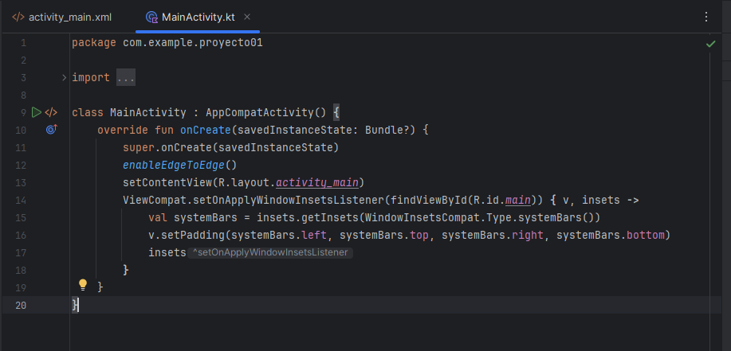

## Android Studio
### Como crear "Hola Mundo"
**Paso a paso:**

- Crear un nuevo proyecto
- Seleccionar "Empty Views Activity"
- Nombrar el proyecto
- Crear la clase y nombrarla
- override fun onCreate

